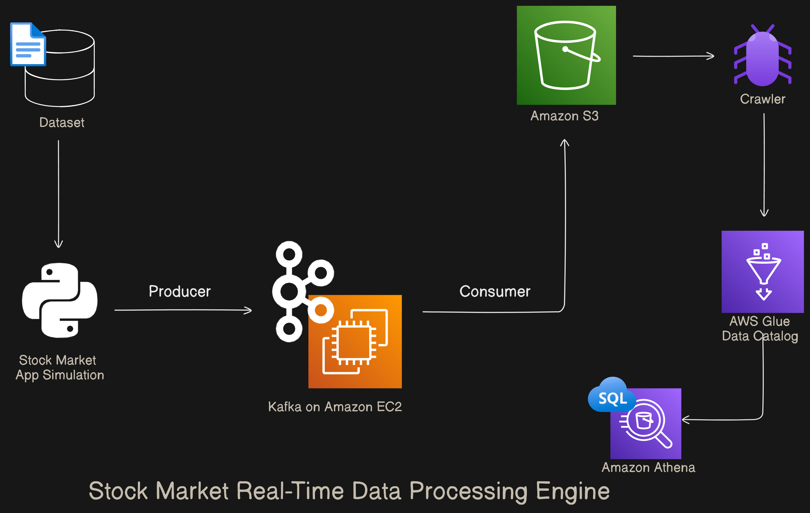

Stock-Market-Real-Time-Data-Processing Engine
=============================================

Project Overview
----------------

The **Stock Market Real-Time Data Processing Engine** is designed to simulate real-time stock market data using Python, closely mimicking live market conditions. By providing continuous and dynamic data streams, this project enables robust analysis of stock market behavior. Let’s dive into the key components and setup instructions:

### Key Components

1.  **Data Simulation with Python:**
    
    *   We use Python to generate synthetic real-time stock market data.
        
    *   The data streams produced resemble actual market conditions, allowing us to test and analyze various scenarios.
        
2.  **Apache Kafka on AWS EC2:**
    
    *   Our system relies on Apache Kafka, deployed on AWS EC2 instances.
        
    *   Kafka ensures reliable and scalable data streaming.
        
    *   It facilitates high-throughput and fault-tolerant data transmission across different components of our system.
        
3.  **Data Storage with AWS S3:**
    
    *   All stock market data is stored in Amazon S3.
        
    *   Leveraging S3’s scalability and durability, we securely manage large volumes of data.
        
    *   S3 provides a robust foundation for our data storage needs.
        
4.  **Data Transformation and Analysis:**
    
    *   AWS Glue is employed for data transformation tasks.
        
    *   AWS Athena, a serverless query service, allows us to analyze the data efficiently.
        
    *   With Athena’s SQL-based querying, we extract valuable insights from the stock market data.
        

For detailed setup commands and troubleshooting, please refer to the allCommand.txt file.

## Special Thanks

We would like to extend our gratitude to the following tools and services that made this project possible:

- **[Apache Kafka](https://kafka.apache.org/):**
  Special thanks to the Apache Kafka team for their incredible work on creating and maintaining such a robust and scalable streaming platform. The extensive and well-documented resources provided in the [Kafka documentation](https://kafka.apache.org/documentation/) were instrumental in helping us set up and manage our data streams efficiently. Kafka's reliability and scalability are key components that make real-time data processing seamless and fault-tolerant.

- **[Amazon Web Services (AWS)](https://aws.amazon.com/):**
  AWS has been the backbone of our infrastructure, providing essential services such as EC2, S3, Glue, and Athena. Their comprehensive cloud solutions have enabled us to build, deploy, and scale our data processing engine with ease and confidence.

- **[Python](https://www.python.org/):**
  Python's versatility and ease of use have been central to our project. The rich ecosystem of libraries and frameworks available in Python has empowered us to simulate real-time stock market data and integrate seamlessly with other components of our pipeline.

